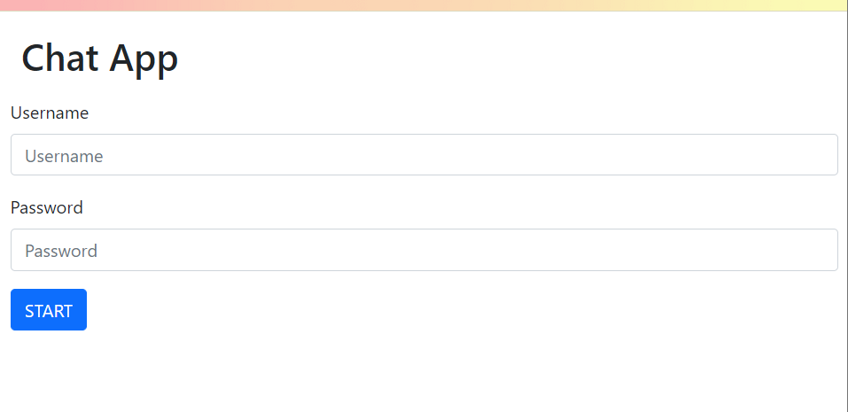
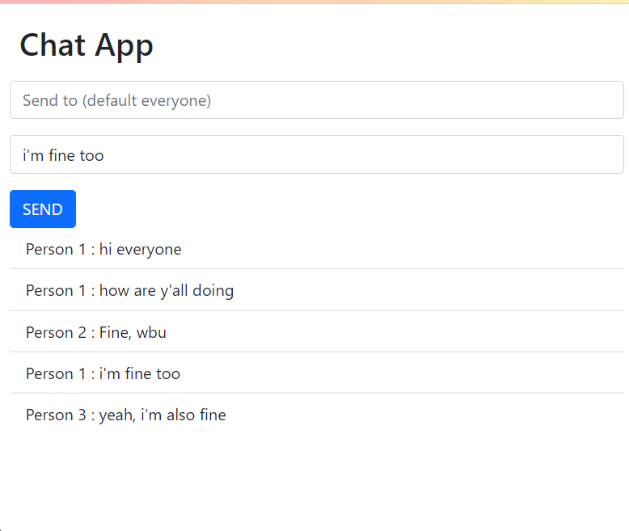

# Chat App With User Authetication

This is a chat app made using socket.io wherein users can join and either broadcast their messages to everyone present in the chat room or specify a particular user to whom a message is to be delivered. Users have to singin into their id in oder to chat. The passwords are stored on the server though and OAuth has not been used in this project.

## Screenshots

